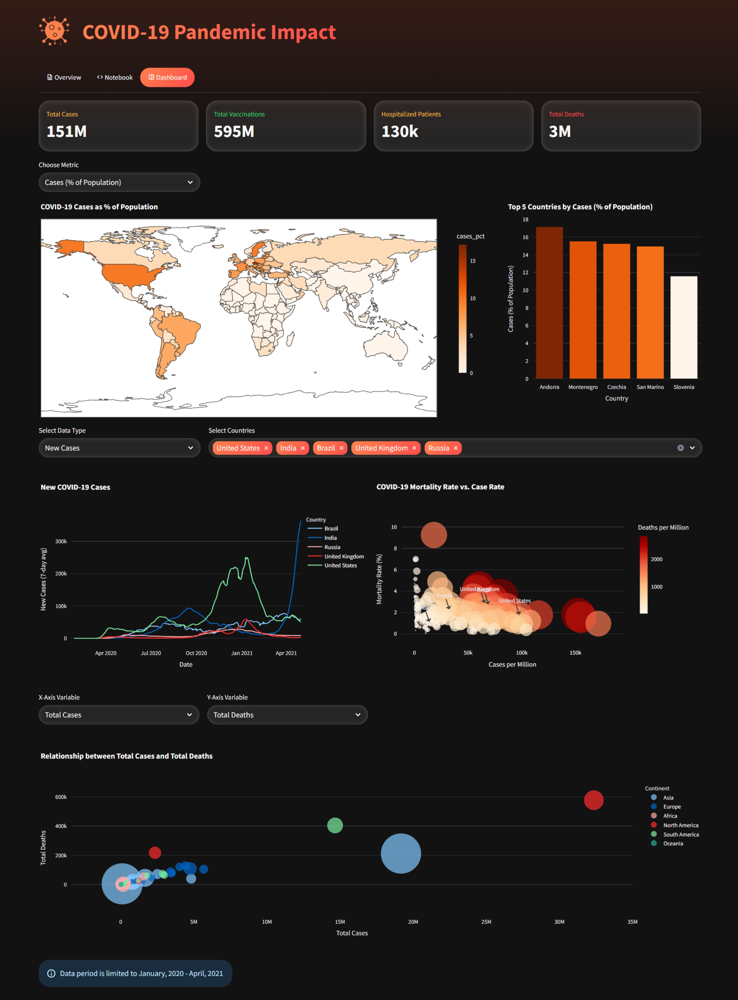

# COVID-19 Pandemic Impact

## Project Overview

The COVID-19 pandemic has had a profound impact on the world. This project aims to understand and visualize this impact by analyzing a comprehensive dataset from [Our World In Data](https://ourworldindata.org) that covers various aspects of the pandemic, including cases, deaths, vaccinations, and other health-related metrics. The analysis is presented through an interactive dashboard, allowing users to explore the data and gain insights into the pandemic's progression and effects.

## Objective

The main objectives of this project are:

* To perform a thorough exploratory data analysis (EDA) to uncover trends, patterns, and relationships within the COVID-19 dataset.
* To identify key metrics and insights related to the pandemic, such as infection rates, mortality rates, and vaccination progress across different countries and continents.
* To develop an interactive and visually appealing dashboard that allows users to explore the data dynamically.
* To provide a clear and concise summary of the findings from the analysis.

## Methodology

The project involved two main steps. First, an exploratory data analysis (EDA) was performed in a **Jupyter Notebook** using **DuckDB**. The dataset was cleaned, and SQL queries were used to analyze global, continental, and country-level data on cases, deaths, and vaccinations.

Second, an interactive dashboard was built with **Streamlit** and **Plotly** to visualize these findings. The dashboard features global stats, a choropleth map, time-series charts, and scatter plots to allow users to dynamically explore the pandemic's impact.

## Key Takeaways

The analysis of the COVID-19 dataset revealed several key insights:

* **Global Impact:** The pandemic resulted in over 151 million cases and 3 million deaths globally within the analyzed period.
* **Country-Specific Analysis:** Countries like the United States, Brazil, and India were among the most affected in terms of total cases and deaths.
* **Mortality Rates:** The mortality rate varied significantly between countries, with Mexico showing a notably high death percentage among confirmed cases.
* **Continental Differences:** Europe and North America had the highest total death counts among the continents.
* **Vaccination Progress:** The dashboard tracks the cumulative number of vaccinations, showing the progress of vaccination campaigns in different countries.
* **Healthcare System Strain:** The analysis of hospital capacity versus patient numbers highlights the strain on healthcare systems, with countries like Spain and the UK showing significant hospital strain percentages.

## Conclusion

This project provides a comprehensive analysis of the COVID-19 pandemic, from initial data exploration to the development of a fully interactive dashboard. The findings highlight the vast and varied impact of the pandemic across the globe. The interactive dashboard serves as a powerful tool for visualizing and understanding these complex dynamics, making the data accessible to a wider audience. Through this analysis, we can better comprehend the scale of the pandemic and the factors that influenced its spread and severity.
